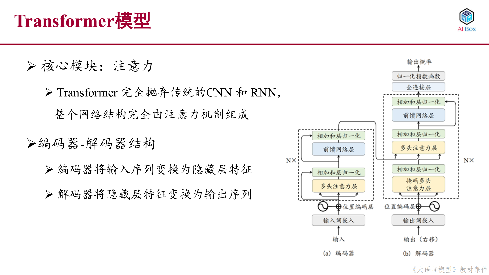

# Transformer模型



## 核心模块：注意力机制

Transformer完全抛弃了传统的CNN和RNN结构，整个网络结构完全由注意力机制组成。这种创新的架构设计带来了以下优势：

- 并行计算：不同于RNN的顺序处理，Transformer可以并行处理整个序列
- 全局依赖：通过自注意力机制直接建模序列中任意位置间的关系
- 更强的特征提取能力：多头注意力机制从不同角度提取特征

### 注意力机制工作原理

注意力机制可以视为一种基于相似度的查表操作，其核心步骤如下：

1. **计算query与key的相似度**：
   - 通过点积运算计算query与每个key的相似度
   - 公式：$e_{ij} = q_i^T k_j$
   - 相似度越高表示两个位置的关联越强

2. **相似度规范化**：
   - 使用softmax函数将相似度转换为概率分布
   - 公式：$\alpha_{ij} = \frac{exp(e_{ij})}{\sum_{j'} exp(e_{ij'})}$
   - 确保所有注意力权重之和为1

3. **加权求和**：
   - 根据注意力权重对value进行加权求和
   - 公式：$o_i = \sum_j \alpha_{ij} v_j$
   - 得到融合了上下文信息的输出表示

这种机制使得模型能够：
- 动态分配注意力权重
- 捕捉长距离依赖关系
- 实现基于内容的特征提取

### 多头注意力机制

多头注意力机制是Transformer的一个重要创新，它包含两个核心部分：

1. **Scaled Dot-Product Attention（单头计算）**：
   - 输入：Query(Q)、Key(K)、Value(V)三个矩阵
   - 将输入X映射为Q、K、V矩阵：
     ```
     $$Q = XW^Q, K = XW^K, V = XW^V$$
     ```
     其中W^Q、W^K、W^V为可学习的权重矩阵
   - 计算步骤：
     1. 矩阵乘法：Q与K的转置相乘，得到注意力分数矩阵
     2. 缩放：将注意力分数除以维度的平方根√d_k，防止梯度消失
     3. Mask（可选）：在解码器中使用，防止看到未来信息
     4. Softmax：对缩放后的分数应用softmax，归一化得到注意力权重
     5. 与V相乘：将注意力权重与V相乘，得到加权的值向量
   - 完整公式：
     ```
     $$Attention(Q,K,V) = softmax(\frac{QK^T}{\sqrt{d_k}})V$$
     ```

2. **Multi-Head Attention（多头拼接）**：
   - 将输入投影到多个子空间：
     - Q、K、V各自通过线性变换产生h组
     - 每组使用不同的投影矩阵
   - 并行计算h个注意力头：
     - 每个头独立计算Scaled Dot-Product Attention
     - 捕捉不同类型的注意力模式
   - 拼接多头输出：
     - 将h个头的输出拼接
     - 通过线性变换融合多头信息

多头注意力机制中"拆分再合并"的设计有两个主要优势：

1. 多角度特征提取：将注意力分为多个头形成多个子空间，使模型能够从不同角度关注序列中的信息。每个注意力头可以专注于捕捉不同类型的特征关系，比如语法关系、语义关系等。
2. 类似CNN的多通道效果：多头注意力计算的结果类似于CNN中同时使用多个卷积核的作用。通过多个头的并行计算和最终的特征融合，模型能够获得更丰富和全面的特征表示。
这种设计大大增强了模型的特征提取能力和表达能力，是Transformer架构成功的关键因素之一。

## 编码器-解码器结构

### 编码器（Encoder）

编码器由N个相同的编码器层堆叠而成，每一层都包含以下核心组件：

1. **位置编码层**：为输入序列添加位置信息，使模型能够感知序列中词的相对或绝对位置

2. **多头注意力层**：
   - 计算序列内部的注意力权重，捕捉词与词之间的依赖关系
   - 从多个不同的表示空间提取特征信息，增强模型的特征提取能力
   - 通过并行的多个注意力头，同时关注序列的不同方面

3. **前馈网络层**：
   - 对注意力层的输出进行非线性变换
   - 进一步提取和转换特征表示

4. **残差连接和层归一化**：
   - 残差连接：
     - 将每个子层的输入直接加到其输出上，形成跨层连接
     - 帮助信息和梯度更容易流动，缓解梯度消失和爆炸问题
     - 使得网络能够训练更深的层数，提升模型容量
   - 层归一化：
     - 对每一层的输出进行标准化处理，使数据分布更稳定
     - 通过重新放缩特征，加速模型训练收敛
     - 减少内部协变量偏移，提高训练效率
   
   这两种技术的结合使得Transformer能够：
   - 训练更深的网络结构而不会出现退化
   - 保持数值稳定性，加快训练收敛
   - 提升模型的整体性能和泛化能力

每一层的计算过程可以表示为：
```
X'_l = LayerNorm(MHA(X_l-1) + X_l-1)
X_l = LayerNorm(FFN(X'_l) + X'_l)
```
其中，X_l-1表示第l-1层的输出，MHA表示多头注意力操作，FFN表示前馈神经网络，LayerNorm表示层归一化。

### 解码器（Decoder）

解码器由N个相同的解码器层堆叠而成，每一层包含以下核心组件：

1. **掩码多头注意力层**：
   - 确保解码时只能看到已生成的输出
   - 防止信息泄露

2. **编码器-解码器注意力层**：
   - 将编码器的输出信息融入解码过程
   - 实现输入-输出的对齐

3. **前馈网络层**：转换特征

4. **残差连接和层归一化**：
   - 残差连接：
     - 将每个子层的输入直接加到其输出上，形成跨层连接
     - 帮助信息和梯度更容易流动，缓解梯度消失和爆炸问题
     - 使得网络能够训练更深的层数，提升模型容量
   - 层归一化：
     - 对每一层的输出进行标准化处理，使数据分布更稳定
     - 通过重新放缩特征，加速模型训练收敛
     - 减少内部协变量偏移，提高训练效率
   
   这两种技术的结合使得Transformer能够：
   - 训练更深的网络结构而不会出现退化
   - 保持数值稳定性，加快训练收敛
   - 提升模型的整体性能和泛化能力

每一层的计算过程可以表示为：
```
Y'_l = LayerNorm(MaskedMHA(Y_l-1) + Y_l-1)
Y''_l = LayerNorm(CrossMHA(Y'_l, X_L) + Y'_l)
Y_l = LayerNorm(FFN(Y''_l) + Y''_l)
```
其中：
- Y_l-1：解码器第l-1层的输出
- X_L：编码器第L层的输出
- MaskedMHA：掩码多头注意力操作
- CrossMHA：编码器-解码器交叉注意力操作
- FFN：前馈神经网络
- LayerNorm：层归一化

这三个计算步骤分别完成：
1. 掩码自注意力：处理已生成的输出序列
2. 交叉注意力：融合编码器的输入信息
3. 特征转换：通过前馈网络进行特征变换
4. **归一化层**：保持数值稳定

## 工作流程

1. **编码阶段**：
   - 输入序列首先经过位置编码
   - 通过多层编码器块处理得到隐藏层特征

2. **解码阶段**：
   - 输出序列经过位置编码
   - 使用掩码自注意力处理已生成的输出
   - 通过编码器-解码器注意力层融合输入信息
   - 最终生成下一个位置的预测

这种设计使得Transformer能够高效地处理序列转换任务，已成为现代语言模型的基础架构。

### Q,K,V在编码器、解码器中各是什么?

在Transformer模型中，Q、K、V在编码器和解码器中的角色有所不同：

在编码器中：

- Q、K、V都来自同一个输入，即编码器前一层的输出
- 这种设计使得编码器能够充分捕捉输入序列内部的依赖关系
在解码器中：

- Q来自解码器前一层的输出
- K和V来自编码器的最终输出
- 这种设计使得解码器能够将编码器的信息融入到解码过程中，实现输入和输出的对齐
这种设计使得模型能够在编码阶段充分理解输入信息，在解码阶段有效地利用编码的信息来生成输出。

### 为什么要用点积?有其他候选吗?

在Transformer中选择使用点积（Dot-Product）而不是其他方式（如加法注意力）计算注意力权重主要有两个原因：

1. 计算效率高：点积可以通过高度优化的矩阵乘法来实现，这使得它在实践中比其他方法（如使用前馈网络的加法注意力）更快且更节省空间。
2. 理论复杂度相似：虽然点积和加法注意力在理论复杂度上相似，但点积注意力可以利用现代硬件和优化库进行高效的矩阵运算，这使得它在实际应用中具有明显的性能优势。
这也是为什么点积注意力成为了Transformer架构中的标准选择。


### 为什么要scale，即除以VD(D为隐藏层特征维度)?

在Transformer中使用缩放点积注意力机制（除以√D）的原因是为了防止点积结果变得过大。当输入维度D较大时，点积的结果会变得很大，这会导致softmax函数进入梯度很小的区域，影响模型的训练效果。通过除以√D进行缩放，可以将点积结果控制在合适的范围内，使得softmax函数的梯度保持在一个合理的区间，从而提高模型的训练稳定性和效果

## 输出层

输出层是Transformer模型的最后一个组件，负责将解码器的输出转换为最终的预测结果。它主要包含两个关键部分：

1. **全连接层**：
   - 将解码器的输出映射到词表空间
   - 通过可学习的权重矩阵进行线性变换
   - 生成每个词表位置的logits分数

2. **归一化指数函数（Softmax）**：
   - 将logits转换为概率分布
   - 公式：$O = softmax(W^L Y_L)$
   - 确保所有预测概率之和为1

这种设计的优势：
- 全连接层提供了从特征空间到词表空间的映射
- Softmax保证了输出是合法的概率分布
- 模型可以在每个时间步生成合理的词元预测

## 输入编码

Transformer的输入编码由两个关键部分组成：

$$x_t = v_t + p_t$$

其中：

1. **词嵌入(vt)**：
   - 表示词元的语义信息
   - 通过嵌入模块将词元映射为词向量
   - 捕捉词的语义特征和上下文关系

2. **位置编码(pt)**：
   - 表示词元的位置信息
   - 根据词元在序列中的绝对位置分配位置向量
   - 使模型能够感知序列中词的相对或绝对位置关系

这种设计的优势：
- 词嵌入保证了模型对输入词的语义理解
- 位置编码弥补了自注意力机制对位置不敏感的缺陷
- 两者相加形成的输入表示同时包含了语义和位置信息

## 位置编码

位置编码是Transformer模型的一个关键组成部分，其设计基于以下核心原理：

1. **必要性**：
   - Transformer本身不具备建模顺序序列的能力
   - 自注意力机制对输入序列的位置关系不敏感
   - 需要显式地将位置信息注入到模型中

2. **实现方式**：
   - 在输入词嵌入中加入位置编码信息
   - 可以使用绝对位置编码或相对位置编码
   - 通过可学习的参数或固定的数学函数生成

3. **作用机制**：
   - 为每个位置生成唯一的编码向量
   - 与词嵌入向量进行元素级加和
   - 使模型能够区分不同位置的相同词元

4. **优势特点**：
   - 保持了模型的并行计算能力
   - 不改变词嵌入的语义表示
   - 支持处理任意长度的输入序列

### 具体实现

论文中采用了基于三角函数的位置编码方法，具体公式如下：

$$PE(pos,2i) = sin(\frac{pos}{10000^{2i/d_{model}}})$$
$$PE(pos,2i+1) = cos(\frac{pos}{10000^{2i/d_{model}}})$$

其中：
- pos：表示词在句子中的位置
- i：词嵌入维度的序号
- d_model：词嵌入的维度

这种设计的优势：
1. 每个位置都有唯一的编码
2. 编码之间的相对关系是确定的
3. 可以处理任意长度的序列
4. 不需要训练，直接通过数学函数生成

通过位置编码的引入，Transformer能够：
- 感知序列中词元的相对或绝对位置
- 正确理解和处理序列的顺序信息
- 在保持并行计算优势的同时处理序列依赖

### 前馈网络层

前馈网络层（FFN）是Transformer中的一个重要组件，用于学习复杂的函数关系和特征。它包含两个主要部分：

1. 线性变换：通过可学习的权重矩阵进行先升维、后降维的变换
2. 非线性激活函数：使用ReLU或GELU等激活函数引入非线性特性
这种设计使得模型能够在注意力机制之后进一步处理和转换特征，增强了模型的表达能力。公式 $FFN(X) = \sigma(XW^U + b_1)W^D + b_2$ 中，$\sigma$ 表示非线性激活函数，$W^U$ 和 $W^D$ 分别是升维和降维的权重矩阵。