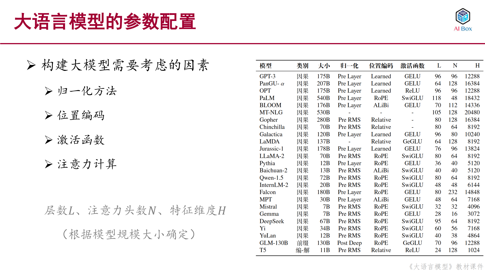

# 模型详细配置

从图中可以看出，构建大模型需要考虑以下几个关键因素：

1. 归一化方法：包括Pre Layer、Pre RMS、Post Deep等不同的归一化策略
2. 位置编码：包括Learned（可学习）、RoPE（旋转位置编码）、ALiBi（注意力线性偏置）、Relative（相对位置编码）等方式
3. 激活函数：主要使用GELU、SwiGLU、ReLU等，不同模型选择不同的激活函数
4. 架构参数：包括层数（L）、注意力头数（N）和隐藏层维度（H），这些参数根据模型规模大小确定
从表格中可以看出，不同的模型在这些因素的选择上各有特点，比如GPT-3使用Pre Layer归一化和GELU激活函数，而LLaMA-2则采用Pre RMS归一化和SwiGLU激活函数。这些选择都会影响模型的性能和训练效果。