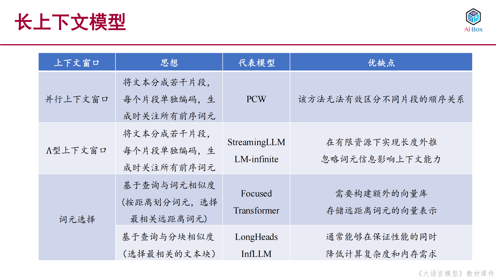

# 长上下文模型和新型架构

## 长上下文模型

长上下文模型主要具备以下几种能力：

1. 更长的上下文理解：能够处理和理解更长的输入序列，通常可以处理数千甚至数万个token。
2. 跨文档推理：能够在多个文档或长文本之间进行信息整合和推理，理解文档间的关联。
3. 长期记忆：能够在长序列中保持对早期信息的记忆，并在后续处理中利用这些信息。
4. 复杂任务处理：能够处理需要长期依赖的任务，如长文档摘要、多轮对话、代码分析等。
5. 知识整合：能够从长文本中提取和整合知识，形成更完整的理解和推理。
这些能力使长上下文模型在处理复杂任务和长文本应用场景中表现出色。

### 长度外推（Length Extrapolation）

长度外推是指模型在处理超出原始训练长度的文本时保持性能的能力：

- 在超出原始上下文窗口的文本上依旧保持与上下文窗口内部相似的性能
- 代表模型：ALiBi、T5 Bias、xPos

#### ALiBi位置编码

ALiBi（Attention with Linear Biases）位置编码引入了与相对距离成比例的惩罚因子来调整注意力分数：

➤ ALiBi位置编码
- 引入了与相对距离成比例的惩罚因子来调整注意力分数
- 在注意力计算中加入负偏置项-m(i-j)，其中i-j表示两个位置的相对距离
- m是一个可学习的参数，随着相对距离增加，惩罚项也相应增加

➤ 仍然无法保证在超出上下文窗口后对文本的理解能力：
- 从困惑度（Perplexity）指标来看，随着序列长度增加，即使是ALiBi也会出现性能下降
- 在检索准确率方面，当序列长度从512扩展到8192时，准确率呈现明显的下降趋势
- 不同规模的模型（60M、180M、1.2B）都表现出类似的性能衰减特征

注意力分数计算公式：
Aij = xiWQWKTxjT - m(i-j),

这种设计的优势：
- 使距离越远的token之间的注意力分数越小
- 帮助模型更好地处理长距离依赖关系
- 不需要外推到更长序列时重新训练位置编码

从实验结果可以看出：
- ALiBi模型表现最为稳定，在处理超出训练长度（512/1024 tokens）的文本时，性能衰减最小
- T5 Bias和Rotary位置编码在更长序列上性能逐渐下降
- Sinusoidal位置编码在超出训练长度后性能迅速恶化

这种长度外推能力对于构建高性能的长上下文模型至关重要，因为它使模型能够可靠地处理远超训练长度的输入文本。

#### 扩展位置编码

扩展位置编码是一种改进方法，旨在解决模型处理超长序列时的性能问题：

➤ 基本原理
- 目标是将原始上下文窗口Tmax扩展到更大的目标上下文窗口T'max
- 传统位置编码在未见范围内会出现性能衰减
- 通过位置插值方法改进外推能力

➤ 改进方法
- 位置插值：在原始位置编码的基础上进行插值，使模型能够平滑地处理更长序列
- 保持连续性：确保扩展后的位置编码与原始编码在数值上保持连续
- 减少外推误差：通过插值减少在未见长度范围内的表示偏差

从图中对比可以看出：
- 上图显示了普通位置编码在未见范围内的外推效果，存在明显的性能衰减
- 下图展示了位置插值方法的效果，能够更好地保持模型在超长序列上的表现

#### 扩展位置编码（以RoPE为例）

以RoPE（Rotary Position Embedding）为例，通过在每个子空间上引入相对位置的旋转角度来实现位置编码：
- 在每个子空间i上，相对位置t的旋转角度为f(t,i) = t·θᵢ
- 通过调整旋转角度f(t,i)达到扩展上下文长度的目标
- 修改相对位置索引t：g(t)
- 修改旋转基θᵢ：h(i)

➤ 改进方法一：修改相对位置索引t
- ReRoPE：通过缩放相对位置来扩展上下文长度
  - 所有位置索引乘以一个小于1的系数，即g(t)=\frac{T_{max}}{T'_{max}}·t
  - 通过这种缩放，将原始上下文窗口从2048扩展到4096
  - 保证旋转角度不超过最大值，维持模型性能
  - 保持位置编码的相对关系

- LeakyReRoPE：引入可学习的泄漏参数
  - 在ReRoPE基础上增加可学习参数
  - 提高模型在长序列上的适应能力

➤ 改进方法二：修改旋转基θᵢ
- NTK-RoPE：基于神经切线核（Neural Tangent Kernel）的改进
  - 通过修改旋转基h(i)来优化位置编码
  - 提高模型在长序列上的稳定性

- Dynamic-NTK-RoPE：动态调整旋转基
  - 根据序列长度动态调整旋转基参数
  - 实现更灵活的长度适应能力

这些改进方法的效果对比：
- 修改相对位置索引的方法（ReRoPE、LeakyReRoPE）在保持原有性能的同时实现了长度扩展
- 修改旋转基的方法（NTK-RoPE、Dynamic-NTK-RoPE）在处理超长序列时表现出更好的稳定性
- 不同方法可以结合使用，进一步模型的长度外推能力

### 上下文窗口

### 基于长文本数据的继续预训练

* 数据量:少量长文本数据可以实现有效的上下文窗口扩展
1B tokens 可将 7B和13B LLaMA上下文长度有效拓展到100K

* 数据混合
领域多样化，并与预训练数据分布比例尽量相似
去除杂乱文本，保留连贯长文本，并对多篇相关文本聚合以及上采样

### 以 Qwen2.5 和 Kimi K1.5 为例

➤ 以 Qwen2.5 和 Kimi K1.5 为例

➤ Qwen2.5
- 修改 RoPE 旋转基的底数 (10,000 调整为1,000,000)，上下文窗口大小从 4096 扩展至 32768

➤ Qwen2.5-Turbo
- 采用渐进式的四阶段训练策略，设置窗口大小分别为 32768、65536、131072 和 262144，
  将底数从 1,000,000 逐渐调整为 10,000,000
- 每阶段的训练数据：40% 当前最大长度的序列 + 60% 短序列

➤ Kimi K1.5
- 预训练阶段逐渐扩展上下文窗口从 4K 到 32K，再到 128K

## 新型模型架构
### 参数化状态空间模型（State Space Model, SSM）

SSM是一种新型的模型架构，具有以下特点：

➤ 结构特点
- RNN和CNN的结合体，融合了两种架构的优势
- 利用卷积计算实现并行编码
- 仅依赖于前一个状态进行循环推理

➤ 与Transformer的对比优势
- 在长文本建模效率方面表现突出
- 可并行强劲，支持高效的并行计算
- 解码复杂度为O(N²H + H²)，相比Transformer的O(TH + H²)更优
- 训练复杂度为O(TH log T + THN² + TH²)，在处理长序列时更高效

其中：
- T：序列长度
- H：输入表示维度
- N：状态空间模型压缩后的维度

这种架构设计使得SSM在处理长文本时能够保持较高的计算效率，同时维持良好的建模能力。

➤ 递归分解
- 通过递归分解当前时刻的输出yt，可以将其表示为所有历史输入的卷积和
- 卷积核K由一系列矩阵组合构成：K = (C⊗B, C⊗A⊗B, ..., C⊗A^(t-1)⊗B, ...)
- 最终输出可表示为输入序列x与卷积核K的卷积：y = x * K

➤ 高效计算
- 利用傅里叶变换将卷积运算转换为频域上的乘法运算
- 显著降低计算复杂度，使模型能够高效处理长序列数据
- 可以使用傅里叶变换实现高效的并行计算

➤ 工作原理
- 状态更新：基于当前时刻的输入xt和前一时刻的状态St-1计算当前状态St
  - 使用矩阵A和B进行计算：St = A⊗St-1 + B⊗xt
  - A矩阵捕捉状态转移关系
  - B矩阵处理输入信息

- 输出映射：将当前状态St映射为输出yt
  - 使用矩阵C进行计算：yt = C⊗St
  - C矩阵将状态信息转换为输出表示

这种设计使得模型能够：
- 高效处理长序列数据
- 维持状态信息的连续性
- 实现并行计算和快速推理

### 状态空间模型变种

#### Mamba

➤ 引入基于当前输入的信息选择机制
- 矩阵A、B、C被表示成基于输入xt的非线性函数
- 通过这种设计对历史信息进行选择性过滤

➤ 基于当前输入xt的选择机制
- A(xt)：状态转移矩阵，根据当前输入动态调整状态更新方式
- B(xt)：输入映射矩阵，控制当前输入的信息如何融入状态
- C(xt)：输出映射矩阵，决定如何从状态中提取信息

➤ 优点
- 增强了模型的表达能力
- 能够根据输入内容动态调整信息处理方式
- 实现了更灵活的历史信息选择机制

➤ 局限性
- 由于在状态计算过程中引入非线性变换
- 无法利用快速傅里叶变换实现高效卷积计算
- 计算效率相对较低

#### RWKV

RWKV是一种创新的状态空间模型变体，具有以下特点：

➤ Token Shift机制
- 将当前词元和前一个词元进行线性插值
- 通过这种方式实现对历史信息的有效利用
- 保持了计算的线性复杂度

➤ 双重混合模块
- Time-Mixing模块：处理序列的时间维度信息
  - 捕捉序列中的长期依赖关系
  - 通过状态更新实现信息传递

- Channel-Mixing模块：处理特征通道之间的交互
  - 增强模型的表达能力
  - 实现特征之间的有效融合

➤ 优势
- 计算复杂度为线性O(n)，优于传统Transformer的二次方复杂度
- 能够高效处理长序列输入
- 在保持性能的同时显著提升推理速度

➤ 创新设计
- 将RNN的循环特性与Transformer的并行能力相结合
- 通过线性注意力机制实现高效计算
- 在长文本处理任务中呈现出优秀的性能

➤ Time-Mixing模块的工作原理
- 替代传统Transformer的注意力层
  - 通过门控RNN方式处理序列信息
  - 使用WKV算子进行时间维度的信息融合
  - 实现了O(n)的线性计算复杂度

- 核心组件
  - σ（sigma）：控制当前时刻的信息权重
  - R：重置门，控制历史信息的保留程度
  - K：控制不同时间位置的注意力分数
  - V：对输入信息进行变换

- 信息处理流程
  - 对输入序列进行线性变换得到R、K、V
  - 使用WKV算子计算时间维度的注意力分数
  - 通过σ和R对历史信息进行选择性保留
  - 最终输出融合了历史和当前时刻的信息

这种设计使得RWKV能够：
- 高效处理长序列依赖关系
- 保持计算复杂度的线性增长
- 在推理时获得类似RNN的并行效率

➤ Channel-Mixing模块的工作原理
- 替代传统Transformer的前馈网络层
  - 通过词元偏移实现特征通道间的交互
  - 使用μ参数控制特征融合的程度
  - 保持了计算的线性复杂度

- 核心组件
  - μ：控制特征通道融合的权重参数
  - R'：对输入特征进行重置的门控机制
  - K'：控制特征通道间的交互强度
  - V'：对特征进行非线性变换

- 信息处理流程
  - 对输入特征进行线性变换得到R'、K'、V'
  - 通过μ参数调节特征通道间的交互程度
  - 使用门控机制R'选择性保留特征信息
  - 最终输出融合了多个特征通道的表示

这种设计使得RWKV能够：
- 在保持线性复杂度的同时实现特征间的有效交互
- 通过可学习的参数动态调整特征融合程度
- 在各类NLP任务中呈现出优秀的性能

#### RetNet

➤ 使用多尺度保留模块（Multi-scale Retention, MSR）替换多头注意力机制

➤ 工作原理
- 输入词元被映射为k、q、v三个向量
- 状态更新公式：St = ASt-1 + kᵀvt
- 输出公式：ot = qtSt

➤ 优势
- 计算复杂度为线性O(n)，优于传统Transformer的二次方复杂度
- 能够高效处理长序列输入
- 在保持性能的同时显著提升推理速度

➤ 创新设计
- 将RNN的状态更新特性与Transformer的并行能力相结合
- 通过线性保留机制实现高效计算
- 在长文本处理任务中展现出优秀的性能

#### Hyena

➤ 长卷积模块（Long Convolution）替换多头注意力机制
- 每层包含N个滤波器，每个相对位置索引设置对应的滤波器组成卷积核
  - K = (h(1),...,h(T))
- 每个相对位置累积设置对应的滤波器组成卷积核

➤ 工作原理
- 每层包含N个滤波器，每个滤波器对应一个相对位置索引
- 通过滤波器组合形成卷积核，实现对序列信息的高效处理
- 利用卷积运算实现并行编码，提高计算效率

➤ 优势
- 高效处理长序列信息：通过卷积运算实现并行处理
- 计算复杂度低：相比传统注意力机制有显著优势
- 可扩展性强：能够处理更长的序列输入

➤ 门控机制
- 对于每个卷积核的输出的中间表示zt，使用门控函数g(t)进行加权
- 门控函数可以动态调整不同位置信息的重要性
- 通过这种设计增强了模型对长距离依赖关系的建模能力

➤ 门控机制的优势
- 自适应信息流控制：根据内容动态调整信息的重要性
- 增强长距离建模：通过选择性保留重要信息，提高长距离依赖的捕捉能力
- 维持计算效率：门控操作是轻量级的，不会显著增加计算开销 
